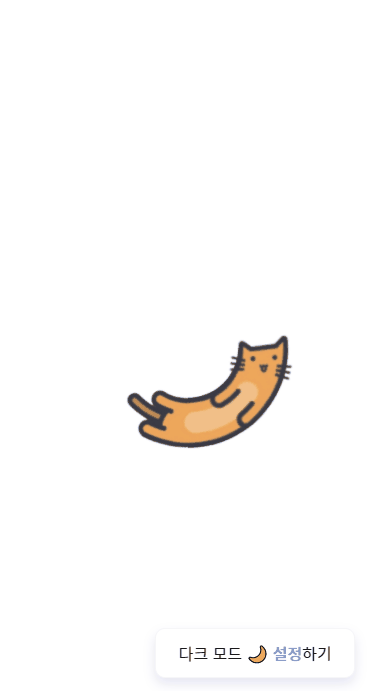
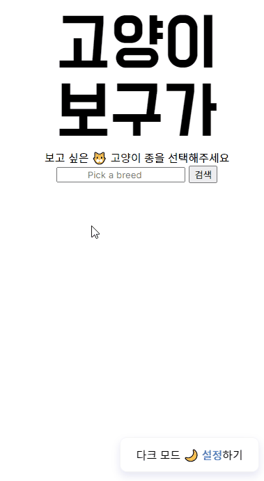
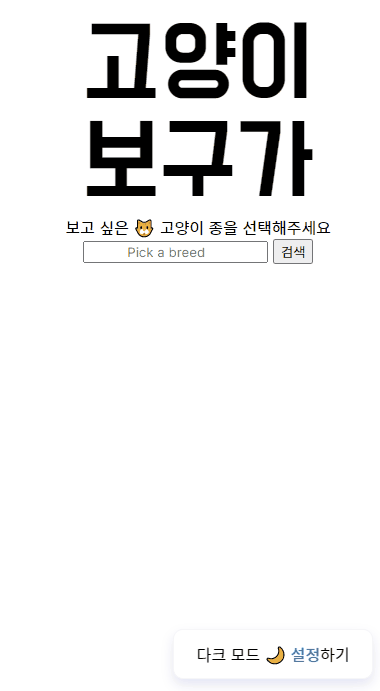
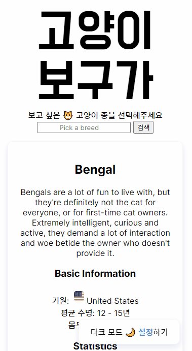
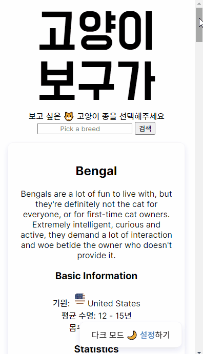

<h1 align="center">🐱 야옹이 보구가</h1>
<p align="center">야옹이 좋아하는 사람들을 위한 야옹이 능력치/사진 검색기</p>
<div align="center">
  
</div>

## Motivation
요즘 대세는 바닐라스크립트다 :tada:

수많은 바닐라스크립트 과제 전형을 뚫고 나아가자.. :runner:

**라이브러리나 프레임워크의 도움 없이**, 오직 바닐라스크립트로만!

프로젝트 기본 설정부터 컴포넌트 구조, 기능 구현까지 멘땅에 헤딩 🤯 하면서 바닐라스크립트 제대로 익혀보자 :fire:

## Project Main Goal
* 선언형 프로그래밍 방식으로 개발하자.
* 컴포넌트 추상화, 컴포넌트 의존도, 상태 관리 등 **컴포넌트 기반 개발 과정에서 꼭 지켜야 할 규칙**은 지키면서 개발하자.
* 렌더링은 정해진 상황 이외의 상황에서 절대 발생하지 않도록 개발하자.
* ES6 표준 모듈화 패턴을 적용하자.
* 읽기 쉬운 코드를 쓰자.
* 불필요한 API 호출은 최소화하자.
* 사용자 경험을 신경쓰자.
* [HTML Semantic Tags](https://www.w3schools.com/html/html5_semantic_elements.asp)를 **올바르게** 적용하자.

## Main Feature
* 내가 키우고 싶은 고양이 종을 검색하면, 해당 고양이 종에 해당하는 고양이들의 능력치와 사진을 제공해준다 :kissing_cat:



* 검색창을 비우고 검색하면, 고양이 사진을 랜덤으로 제공해준다



## Additional Feature
* 애플리케이션 첫 로딩 시, API 검색 요청 시 Loader가 나타난다.


* 다크 모드를 지원한다. 애플리케이션 첫 로딩 시, 이전 방문 기록을 확인하여 방문한 기록이 있다면 마지막으로 봤던 모드대로, 아니라면 사용자 컴퓨터에 설정된 선호 모드대로 표시한다.



* 이미지 레이지 로딩을 지원한다. 뷰포트에 이미지 영역이 들어와야 이미지 렌더링이 시작된다.



* 이상한 검색어에 대한 오류 메시지는 Toast를 통해 알려준다.


## What I Learned
* 기초적 기능만 가지고 있는 프로젝트지만, 사실 가장 큰 수확은 바닐라스크립트로 선언형 프로그래밍 방식의 프로젝트를 만들었다는 점 :pencil:
* 이 프로젝트의 목표는 기능 개발이 아니고 컴포넌트 추상화, 컴포넌트 의존도 등을 바닐라스크립트로 최대한 신경써보고자 하는 것이었다. 험난했던 개발 과정을 보려면 [commit log](https://github.com/yaong2-sprint/yaong2-meow/pull/8#issuecomment-893378251)를 구경하자. *머리로는 알고 있던 개념도 코드로 옮기려니 잔실수가 많았다.* :cry:

### Links
* [Webpack에 대한 기본 개념](readme/webpack.md)
* [Vanilla Javascript로 웹 컴포넌트 만들기](https://junilhwang.github.io/TIL/Javascript/Design/Vanilla-JS-Component/)

## Problems Should Be Fixed
`프로젝트 전반`
* `if-else` 문 사용을 자제하고자 했는데 코드를 짧게 쓰지 못한 것 같다.

`SelectSection.js`
* SelectSection 컴포넌트가 하는 일이 너무 많은 것 같다.
* 한 개만 존재하고 한 번만 렌더링되는 컴포넌트이긴 하지만, `render()` 메소드에서 이벤트 할당이 발생한다는 점은 좋지 않은 것 같다.

## Project Setup
* Install
```
npm install
```
* Run Webpack Dev Server
```
npm run dev
```
